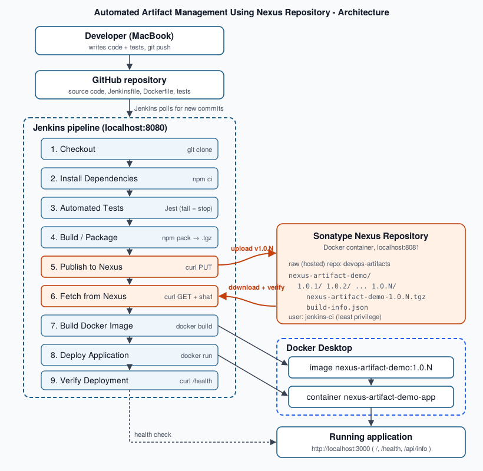

# Automated Artifact Management Using Nexus Repository

> DevOps Mini Project · Batch-wise lab project

| | |
|---|---|
| **Team members** | Kashvi Vora, Rushabh Vora |
| **Group size** | 2 |
| **Stack** | Node.js + Express · Jest · npm · Git/GitHub · Jenkins · Sonatype Nexus Repository · Docker |
| **Pipeline** | GitHub → Jenkins → Test → Package → **Nexus** → Docker → Deployment |

Step-by-step setup from a fresh Mac: **[docs/SETUP_GUIDE.md](docs/SETUP_GUIDE.md)** ·
Troubleshooting: **[docs/TROUBLESHOOTING.md](docs/TROUBLESHOOTING.md)** ·
Demo & viva: **[docs/DEMO_AND_VIVA.md](docs/DEMO_AND_VIVA.md)** ·
Checklist: **[docs/CHECKLIST.md](docs/CHECKLIST.md)**

---

## 1. Project Title

**Automated Artifact Management Using Nexus Repository**

## 2. Team Members

| Name | Role in the project |
|---|---|
| Kashvi Vora | Application, automated tests, Nexus Repository setup and integration |
| Rushabh Vora | Jenkins pipeline, Docker containerization, deployment and verification |

*(Adjust the role split to match how you actually divided the work.)*

## 3. Problem Statement

In many small teams the application is built on a developer's laptop and copied
to the server by hand. This causes common problems:

- Nobody knows exactly **which build** is running in an environment.
- Builds are **not repeatable** ("it works on my machine").
- Old versions are lost, so **rollback** is difficult.
- Untested code can reach deployment because nothing **forces tests to pass**.
- Built files are stored in random places (email, shared drives, Git) instead of a
  proper, secured **artifact repository**.

## 4. Objective

To build an automated CI/CD pipeline in which every code change is
automatically **built, tested, packaged into a versioned artifact, stored in
Sonatype Nexus Repository**, and then **deployed from Nexus** as a Docker
container, with no manual steps and no hard-coded credentials.

## 5. Proposed Solution

1. Developers push code to **GitHub**.
2. **Jenkins** detects the new commit and runs the pipeline defined in the `Jenkinsfile`.
3. Jenkins installs dependencies and runs **Jest** tests. If any test fails, the pipeline stops.
4. Jenkins packages the app with **`npm pack`** into a versioned artifact
   `nexus-artifact-demo-1.0.<BUILD_NUMBER>.tgz`.
5. Jenkins uploads the artifact (plus `build-info.json`) to a **Nexus raw hosted repository**
   using credentials stored securely in Jenkins.
6. Jenkins **downloads that exact version back from Nexus**, verifies its checksum, and
   builds a **Docker image** from it (the Docker build can only see the Nexus artifact).
7. Jenkins replaces the running container with the new version and **verifies** it via `/health`.

### Why Node.js + npm and a *raw* Nexus repository?

- The preferred stack was Node.js. Java + Maven would also work, but it adds a JDK build,
  `pom.xml` and `settings.xml` for no extra learning value here.
- The output of `npm pack` is a single `.tgz` file - a clear, downloadable artifact.
- A **raw (hosted)** repository accepts any file with one HTTP `PUT` request
  (`curl --upload-file`). It needs no extra Nexus realms or `.npmrc` token setup, so it is
  the **simplest reliable** option. The folder structure `app/version/file` makes versions
  very easy to show in the Nexus UI.
- An npm (hosted) repository with `npm publish` is listed under Future Scope.

## 6. Technologies Used

| Technology | Purpose |
|---|---|
| Git + GitHub | Version control and remote source repository |
| Node.js 24 LTS + Express 5 | The web application |
| npm | Dependency management (`npm ci`) and packaging (`npm pack`) |
| Jest + Supertest + jest-junit | Unit and API tests; JUnit XML report for Jenkins |
| Sonatype Nexus Repository (Community Edition) | Stores and versions the build artifacts |
| Docker Desktop | Builds the image and runs the deployed container |
| Docker Compose | Runs Nexus with one command |
| Jenkins LTS (Homebrew) | CI/CD automation server running the `Jenkinsfile` |
| Bash + curl | Upload/download artifacts to/from Nexus REST endpoints |

## 7. System Architecture



```
Developer ──git push──▶ GitHub
                          │  (Jenkins polls every 2 min)
                          ▼
                       Jenkins  ──────────────────────────────────────────┐
                          │ 1 Checkout  2 npm ci  3 Jest tests             │
                          │ 4 npm pack → nexus-artifact-demo-1.0.N.tgz     │
                          │ 5 upload ─────────────▶  Nexus Repository      │
                          │ 6 download + verify ◀──  devops-artifacts/     │
                          │ 7 docker build (from Nexus artifact)           │
                          │ 8 docker run           ─▶ Docker container     │
                          │ 9 verify /health                               │
                          ▼                                                │
              Running application: http://localhost:3000 ◀────────────────┘
```

| Component | Explanation |
|---|---|
| **Developer** | Writes code and tests on the MacBook and pushes to GitHub. |
| **GitHub** | Single source of truth for code, `Jenkinsfile`, `Dockerfile` and tests. |
| **Jenkins** | Automation server. Reads the `Jenkinsfile` from GitHub and runs each stage in order. |
| **Build** | `npm ci` installs exact dependency versions from `package-lock.json`. |
| **Automated tests** | Jest runs 18 unit/API tests. A failure stops the pipeline. |
| **Package artifact** | `npm pack` creates a versioned `.tgz` containing only the app code + `package.json`. |
| **Nexus Repository** | Artifact store. Keeps every version, secured with users/roles, downloadable any time. |
| **Docker image** | Built from the artifact downloaded from Nexus, tagged with the same version. |
| **Deployment** | Jenkins stops the old container and starts the new one on port 3000. |
| **Running application** | The live app; its home page shows the artifact version, build number and Nexus URL. |

## 8. Project Workflow

| # | Jenkins stage | What happens | Fails when |
|---|---|---|---|
| 1 | Checkout | Clones the GitHub repo, records the commit | Repo URL / credentials wrong |
| 2 | Install Dependencies | `npm ci` | Broken `package-lock.json`, no network |
| 3 | Automated Tests | `npm test` (Jest), results published to Jenkins | **Any test fails** |
| 4 | Build / Package | Version set to `1.0.<BUILD_NUMBER>`, `npm pack` → `.tgz` | Packaging error |
| 5 | Publish Artifact to Nexus | Upload `.tgz` + `build-info.json`, verify by download | Nexus down, wrong credentials, repo missing |
| 6 | Fetch Artifact from Nexus | Download the version from Nexus, verify SHA-1 | Artifact missing / corrupted |
| 7 | Build Docker Image | `docker build` → `nexus-artifact-demo:1.0.N` and `:latest` | Docker not running |
| 8 | Deploy Application | Replace container `nexus-artifact-demo-app` on port 3000 | Port in use |
| 9 | Verify Deployment | `/health` is `UP`, version = 1.0.N, API returns correct result | App not healthy |

Each stage only runs if all earlier stages succeeded.

## 9. Project Structure

```
nexus-artifact-demo/
├── src/
│   ├── app.js                 # Express app: routes, home page (exported for tests)
│   ├── server.js              # Starts the HTTP server on PORT (default 3000)
│   └── utils/calculator.js    # Small business logic that is unit-tested
├── tests/
│   ├── app.test.js            # API tests with Supertest
│   └── calculator.test.js     # Unit tests
├── scripts/
│   ├── common.sh              # Shared helpers (Nexus URL, auth, checksums, error messages)
│   ├── publish-to-nexus.sh    # Upload artifact + build-info.json to Nexus
│   ├── download-from-nexus.sh # Download a version from Nexus and verify checksum
│   ├── verify-deployment.sh   # Smoke test of the deployed container
│   └── local-pipeline.sh      # Same stages as Jenkins, from the terminal (backup)
├── docs/
│   ├── SETUP_GUIDE.md         # Steps 1-12 from a fresh Mac
│   ├── TROUBLESHOOTING.md     # Common errors and fixes
│   ├── DEMO_AND_VIVA.md       # Demo script, viva questions, screenshots
│   ├── CHECKLIST.md           # End-to-end checklist
│   ├── architecture.svg/.png  # Architecture diagram
├── Jenkinsfile                # The CI/CD pipeline
├── Dockerfile                 # Image built from the Nexus artifact
├── .dockerignore              # Docker may only see artifact/app.tgz
├── docker-compose.yml         # Runs Nexus Repository
├── package.json / package-lock.json
├── .env.example               # Template for manual runs (real .env is git-ignored)
├── .gitignore
└── README.md
```

## 10. Application Description

A small Express web application (the focus of the project is the pipeline, not the app):

| Endpoint | Description |
|---|---|
| `GET /` | Home page with project title, team, **artifact version, Jenkins build number, Git commit, and the Nexus URL the artifact came from** |
| `GET /health` | `{"status":"UP","version":"1.0.N",...}` - used by Jenkins and the Docker `HEALTHCHECK` |
| `GET /api/info` | Build and artifact information as JSON |
| `GET /api/calculate?op=add&a=10&b=5` | Calculator (`add`, `subtract`, `multiply`, `divide`); returns 400 on invalid input or division by zero |

The version shown by the app is read from `package.json` **inside the artifact**, so the
running page proves which Nexus artifact is deployed.

## 11. Git/GitHub Integration

- All source, tests and pipeline configuration (`Jenkinsfile`, `Dockerfile`,
  `docker-compose.yml`) are version-controlled ("pipeline as code").
- Jenkins uses **"Pipeline script from SCM"**: it clones the repo and reads the `Jenkinsfile`.
- Trigger: **Poll SCM every 2 minutes** (`pollSCM('H/2 * * * *')`). A GitHub webhook
  cannot reach `localhost` on a laptop without a tunnel, so polling is the reliable option.
- `.gitignore` keeps `node_modules/`, build outputs (`dist/`, `artifact/`, `*.tgz`),
  reports and **all `.env` files** out of Git. Only `.env.example` (with placeholders) is committed.
- Build outputs are **not** stored in Git - that is exactly the job of Nexus.

## 12. Automated Testing

- **Jest** with **Supertest** - 18 tests in 2 suites:
  - `calculator.test.js` - unit tests for each operation and for invalid input.
  - `app.test.js` - API tests for `/`, `/health`, `/api/info`, `/api/calculate`, 404 handling, HTML escaping.
- `npm test` writes a JUnit XML report to `reports/junit.xml`; Jenkins shows it under **Test Result**.
- `npm test` exits with a non-zero code on failure → the Jenkins stage fails → **no artifact is
  published and nothing is deployed**.

## 13. Docker Containerization

- Base image: official **`node:24-alpine`** (Node.js LTS, small).
- The image is built **from the artifact downloaded from Nexus** (`artifact/app.tgz`).
  `.dockerignore` is an allow-list, so Docker cannot see the source code at all.
- Only production dependencies are installed (`npm install --omit=dev`).
- Runs as the non-root `node` user, exposes port **3000**, and has a `HEALTHCHECK` on `/health`.
- Tags: `nexus-artifact-demo:1.0.<BUILD_NUMBER>` and `nexus-artifact-demo:latest`.
- Nexus itself runs in Docker via `docker-compose.yml`.

## 14. Nexus Repository Integration

**What is an artifact?** The packaged, ready-to-deploy output of a build. Here it is
`nexus-artifact-demo-1.0.N.tgz`, made by `npm pack`, containing `src/` and `package.json`.

**Why Nexus?** Nexus is a dedicated artifact repository: it stores every version
permanently, controls who can upload/download (users, roles), can block overwriting
released versions, and gives every artifact a stable download URL. Git stores source
code; Nexus stores the built results.

| Setting | Value |
|---|---|
| Nexus URL | `http://localhost:8081` |
| Repository name | `devops-artifacts` |
| Repository type / format | **hosted / raw** |
| Deployment policy | **Disable redeploy** (a released version can never be overwritten) |
| CI user | `jenkins-ci` with role `ci-deployer` (privilege `nx-repository-view-raw-devops-artifacts-*`) |
| Jenkins credential ID | `nexus-credentials` (Username with password) |

**How it is versioned:** `1.0.<Jenkins BUILD_NUMBER>` - unique for every build and
traceable back to the build log and Git commit (`build-info.json`).

**Layout in Nexus:**
```
devops-artifacts/
└── nexus-artifact-demo/
    ├── 1.0.1/
    │   ├── nexus-artifact-demo-1.0.1.tgz
    │   └── build-info.json
    └── 1.0.2/ ...
```

**How Jenkins publishes it:** `scripts/publish-to-nexus.sh` sends an HTTP `PUT` with `curl`:
```
PUT http://localhost:8081/repository/devops-artifacts/nexus-artifact-demo/1.0.N/nexus-artifact-demo-1.0.N.tgz
```
Credentials come from Jenkins (`withCredentials`), are masked in the log, and are passed to
curl through stdin so they never appear on a command line. The script then downloads the
file back and compares SHA-1 checksums to prove the upload is correct.

**How to view/download:** Nexus UI → **Browse** → `devops-artifacts` → folder → file → *Path*
link, or:
```bash
curl -u jenkins-ci -O http://localhost:8081/repository/devops-artifacts/nexus-artifact-demo/1.0.N/nexus-artifact-demo-1.0.N.tgz
```

**How it is used for deployment:** the *Fetch Artifact from Nexus* stage downloads that
version from Nexus, verifies the checksum, and the Docker image is built from it. To
**roll back**, redeploy an older version that is still in Nexus
(see [SETUP_GUIDE Step 12](docs/SETUP_GUIDE.md#step-12--verify-deployment)).

## 15. Jenkins CI/CD Pipeline

- Declarative pipeline in `Jenkinsfile`, job type **Pipeline**, definition **Pipeline script from SCM**.
- Jenkins runs natively on macOS (Homebrew `jenkins-lts`) so it can use the Mac's Docker
  Desktop, Node.js and reach Nexus at `localhost:8081` without extra networking.
- Options: keep last 15 builds, no concurrent builds, 20-minute timeout.
- Plugins used: Pipeline, Git, Credentials Binding, JUnit (all in "Install suggested plugins").
- Secrets: only the credential **ID** `nexus-credentials` is in the `Jenkinsfile`; the
  username/password live encrypted in Jenkins.

## 16. Deployment

The application is deployed as a Docker container (`nexus-artifact-demo-app`) on the
local machine, port **3000**.

**Why local Docker deployment is a suitable environment:** the container is a complete,
isolated runtime built from an immutable versioned artifact - the same image could run
unchanged on any server or cloud VM with Docker. The deployment is fully automated
(stop old → start new → health check), and the running version is traceable to its
Nexus artifact and Git commit. This shows every concept of a real deployment without
paying for or depending on cloud infrastructure during the demo.

## 17. Testing Results

Local test run (`npm test`):

```
PASS tests/app.test.js
PASS tests/calculator.test.js

Test Suites: 2 passed, 2 total
Tests:       18 passed, 18 total
```

Pipeline results to record from **your** run (with screenshots):

| Check | Expected | Your result |
|---|---|---|
| Jenkins build | All 9 stages green | |
| Jenkins Test Result | 18 passed, 0 failed | |
| Nexus | `nexus-artifact-demo/1.0.N/` with `.tgz` + `build-info.json` | |
| `docker images` | `nexus-artifact-demo  1.0.N` and `latest` | |
| `docker ps` | `nexus-artifact-demo-app` Up (healthy), `0.0.0.0:3000->3000` | |
| `curl localhost:3000/health` | `"status":"UP","version":"1.0.N"` | |
| Failing-test run | Pipeline stops at *Automated Tests*, no new version in Nexus | |

## 18. Screenshots to Capture

1. GitHub repository page (file list + commit history)
2. Terminal: `npm test` showing 18 passed
3. Nexus: `devops-artifacts` repository settings (type raw, hosted, Disable redeploy)
4. Jenkins: credential `nexus-credentials` (password hidden)
5. Jenkins: pipeline job configuration (Pipeline script from SCM)
6. Jenkins: Stage View with all stages green
7. Jenkins: console output of *Publish Artifact to Nexus*
8. Jenkins: Test Result page
9. Nexus Browse: `nexus-artifact-demo/1.0.N/` folder with both files
10. Nexus: artifact detail (size, SHA-1, path)
11. Terminal: `docker images` and `docker ps`
12. Browser: `http://localhost:3000` showing version / build / Nexus source
13. Browser or terminal: `/health` and `/api/calculate`
14. Jenkins: failed build (red *Automated Tests*, later stages skipped)
15. Nexus showing multiple versions (1.0.1, 1.0.2, ...)

## 19. How to Run the Project

Full instructions: **[docs/SETUP_GUIDE.md](docs/SETUP_GUIDE.md)**. Short version:

```bash
# 1. Run the app locally
npm ci
npm test
npm start                         # http://localhost:3000  (Ctrl+C to stop)

# 2. Start Nexus
docker compose up -d
docker exec nexus cat /nexus-data/admin.password   # first login password
#    -> create raw hosted repo "devops-artifacts", role + user "jenkins-ci"

# 3. Optional: run the whole pipeline without Jenkins
cp .env.example .env              # put the jenkins-ci password in .env
bash scripts/local-pipeline.sh

# 4. Jenkins
brew services start jenkins-lts   # http://localhost:8080
#    -> add credential "nexus-credentials", create Pipeline job from this GitHub repo, Build Now
```

## 20. Conclusion

The project implements a complete, working CI/CD pipeline in which Nexus Repository is
the central link between building and deploying. Every commit is tested automatically;
only tested code becomes a versioned artifact; every artifact is stored in Nexus with
build metadata; and every deployment uses the exact artifact from Nexus. Credentials are
never stored in code. The result is a repeatable, traceable and secure delivery process
that can roll back to any earlier version.

## 21. Future Scope

- Publish to an **npm (hosted)** repository with `npm publish`, and use an npm **proxy**
  repository in Nexus to cache dependencies from npmjs.org.
- Push the Docker image to a **Docker (hosted) registry in Nexus** instead of building locally.
- Separate **snapshot/release** repositories and a cleanup policy for old snapshots.
- GitHub **webhook** through a tunnel (ngrok) or a Jenkins server with a public URL.
- Code-quality and security scanning (ESLint, SonarQube, `npm audit`).
- Deploy to a cloud VM or a free container platform; add staging → production promotion.
- Email/Slack notifications on pipeline failure.
